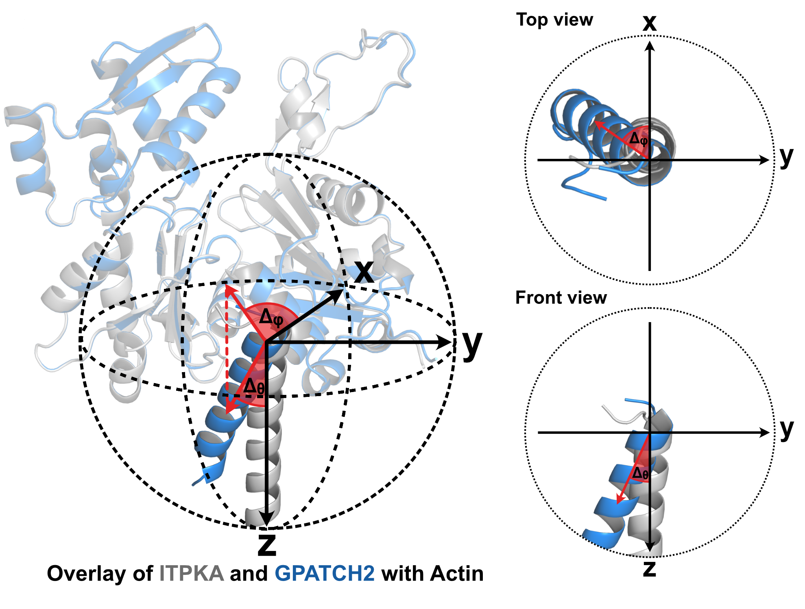

# SLiMFold Pipeline

**Have you noticed two or more short peptide sequences that bind to the same target protein in nearly identical ways?** If so, you may have discovered a novel short linear motif (**SLiM**)! SLiMs are brief amino acid segments that often mediate critical protein–protein interactions. Identifying and characterizing these motifs can be challenging, but that’s precisely where **SLiMFold** comes in. SLiMFold is a modular pipeline designed to systematically uncover, analyze, and refine potential SLiMs using a powerful combination of sequence- and structure-based bioinformatics tools. From an initial set of suspected motif-containing sequences, SLiMFold will:
  - Generate Position-Specific Scoring Matrices (PSSMs) from your input motifs. Search Large Proteomes to find novel motif occurrences, while filtering based on predicted secondary structure, disorder, and binding regions. It also builds multiple sequence alignments (MSAs) and prepares peptide–bait pairs for downstream prediction (**Prerun.ipynb**).
  - Perform structural predictions of motif–target complexes using AlphaFold2 via a modified ColabFold interface (**ColabFold_looped.ipynb**)
  - Conduct robust postanalysis to extract structural metrics, visualize results, and cluster similar predictions to identify distinct motif classes (**Postanalysis.ipynb**).

Whether you're validating a new SLiM or exploring uncharted motif landscapes, SLiMFold streamlines the process and delivers predictions ready for experimental follow-up. Below you will find instructions for installing dependencies, running each notebook, and interpreting the results. (*Note that for very large bait proteins (> 2,950 residues), a H100 GPU might be required, which is not directly accessible within ColabFold. Also be aware that the database for MSA generation, used in this pipeline (UniRef90), may be suboptimal for viral proteins, synthetic constructs, or highly divergent sequences, due to limited homologous coverage in these cases.*).


---

## Installation & Environment

<details>
  
1. **Clone This Repo & Create the Conda Environment**  
   ```bash
   git clone https://github.com/thp42/SLiMFold.git
   cd SLiMFold

   conda env create -f SLiMFold.yml
   conda activate SLiMFold
   ```
2. **Register as Jupyter Kernel** (optional, but recommended)
   ```bash
   python -m ipykernel install --user --name SLiMFold --display-name "SLiMFold"
   ```
3. **Install External Tools**  
   - **PsiPred 4.0**: [psipred GitHub](https://github.com/psipred/psipred)  
   - **IUPred3**: [iupred3.elte.hu](https://iupred3.elte.hu/download_new)  
   - **Databases**: [UniRef90 in .fasta.gz](https://ftp.uniprot.org/pub/databases/uniprot/uniref/uniref90/) & [NCBI protein dataset in .fasta](https://www.ncbi.nlm.nih.gov/datasets/taxonomy/)

</details>


---


## 1. Prerun.ipynb

> This notebook is where the pipeline begins. It creates a position-specific scoring matrix (PSSM) from user-provided input SLiMs and searches the proteome to find candidate sequences. Key filters (```PSSM score```, ```IUPRED```, ```ANCHOR``` and ```PSIPRED```) are applied to reduce false positives, and each hit is paired with the user’s chosen “bait” (e.g., human actin). Next to FASTA files, also Multiple sequence alignments (MSAs) are generated and formatted for a compatible downstream ColabFold prediction.

<details>
  <summary>Details</summary>
  
0. **Open Prerun.ipynb**
  
1. **Folder and pathway setup**
   - Select the kernel ```SLiMFold```
   - Define the paths ```iupred_path```, ```psipred_path```, ```NCBI_protein_database```, ```uniref90_path```, ```reformat_path``` and your ```bait_sequence```. 
   - Execute the cell, enter a project name in the prompt. A consistent project folder structure will be automatically created.  
   - Move your initial FASTA-file to the **Input Folder** and rename it to **input.fasta**. Please make sure that input sequences contain only **the motif without flanking residues** (see example folder). Input motifs should have the same sequence length! 

2. **PSSM Generation with BLOSUM62**  
   - Uses input.fasta and the BLOSUM62 substitution matrix to generate an initial position-specific scoring matrix (PSSM) as CSV-file-output (stored in ```{project_name}/Output/pssm_BLOSUM62.csv```)

3. **Proteome Search**
   - (A) Defines several thresholds for subsequent motif identification (```pssm_cutoff, (default = 10)```, ```iupred_cutoff, (default = 0.4)```, ```anchor_cutoff, (default = 0.4)```, secondary structure cutoffs for helix, strand, coil or unknown). Prompts to define the probable secondary structure (of the motif) involved in the interaction. Choose bewtween 'helix', 'strand', 'coil' or 'unknown'.
     
   - (B) Scores the human proteome (or your proteome of choice) using the PSSM, as well as IUPRED, ANCHOR, PSIPRED. Retains only hits meeting specified cutoffs. Extends each hit by ±20 residues to capture potential context (can be modified by changing ```flanking_aa_size```). As IUPRED, ANCHOR and PSIPRED calculation can be computational demanding, it can take up to 6 hours on 12 CPU threads. This will produce an output FASTA-file containing identified hits (stored in ```{project_name}/Output/PSSM_Hits/Hits.fasta```). 
     
   - (C) Removes identical sequences to avoid running them through jackhmmer and colabfold multiple times. This will produce another FASTA-file containing only non-redundant hits (stored in ```{project_name}/Output/PSSM_Hits/Hits_nonred.fasta```)
     
   - (Optional, if not first iteration): Compare the PSSM-hits of two iterations and write the unique hits to a new FASTA file. Please ignore this cell in case you are running the first iteration.

4. **Bait Fusion and Prey-Bait Preparation**
   - Takes ```Hits_nonred.fasta``` as input, generated in the previous step.
   - The predefined bait sequence is appended to each unique hit, separated by a colon (> header as peptide:bait).
   - Outputs a formatted FASTA-file stored in ```{project_name}/Output/PSSM_Hits/PreyBait.fasta```

5. **Split PreyBait.fasta into individual FASTA files for ColabFold input** 
   - Input: ```PreyBait.fasta``` generated in the previous step.
   - Creates for each PreyBait Sequence pair an individual FASTA file (stored in ```{project_name}/Output/Fasta/```)

6. **Multiple Sequence Alignment for Bait** 
   - The predefined bait sequence is run with jackhmmer (with modified filters) against the UniRef90 database to identify homologs and generates a .sto alignment file (stored in ```{project_name}/Output/MSA/sto```).
   - The filters can be modified by changing ```-E```, ```-N```, ```-F1```, ```-F2``` or ```-F3``` 

7. **Multiple Sequence Alignment for Prey** 
   - Each prey is run with jackhmmer (with modified filters) against the UniRef90 database to identify homologs and generate a .sto alignment file (stored in ```{project_name}/Output/MSA/sto```).
   - The filters can be modified by changing ```-E```, ```-N```, ```-F1```, ```-F2``` or ```-F3```.
   - To speed up computation parallel processing is used. Both, the number of CPU cores per search (```num_cpus_per_process```)  and the number of parallel processes (```num_processes```) can be adjusted.
   - Automatically tracks remaining peptides, so the run can resume from where it left off using the ```input_remaining.fasta``` file, in case of interruption.
   - Running jackhmmer can take approximately 20 minutes per 6 peptides on 12 CPU threads. Depending on the number of non-redundant Hits, this step can take up several hours to a few days.

8. **Converts the .sto to .a3m** 
   - The generated .sto files are converted to a3m files by the hhsuite reformat.pl script. The number of of parallel processes (```num_processes```) can be adjusted.
   - The processed files are stored in ```{project_name}/Output/MSA/a3m```

9. **Sort and Deduplicate a3m files Based on Sequence Identity**
   - Sorts the converted a3m files by global sequence identity to the reference sequence, placing the most similar sequences at the top to improve MSA quality for structure prediction.
   - For the bait MSA (bait_sequence.a3m), the user is prompted whether they want to sort it.
   - Deduplicates the bait and prey a3m files (based on exact sequence match) to remove redundant homologs, ensuring higher sequence diversity and enhancing co-evolutionary signal strength for better complex prediction accuracy.
   - The processed files are stored in ```{project_name}/Output/MSA/sorted_a3m```

10. **Trims the MSA**
    - Takes the sorted a3m files as input and reduces the size of each file by keeping only the first top 2048 sequences (can be modified by changing ```MAX_SEQUENCES```).
    - The processed files are stored in ```{project_name}/Output/MSA/trimmed_a3m```

11. **Combines Bait and Prey MSAs for ColabFold**
    - Combines the trimmed Bait.a3m with each trimmed Prey.a3m and pads them to fit the ColabFold design.  
    - The processed files are stored in ```{project_name}/Output/MSA/combined_a3m```

</details>

---

## 2. ColabFold_looped.ipynb

> This notebook is a modified version of the [ColabFold batch pipeline](https://github.com/sokrypton/ColabFold) originally developed by the Steinegger lab. In our pipeline, ColabFold_looped.ipynb automates structure predictions of candidate prey–bait pairs (e.g., SLiM–actin). The key difference from the original ColabFold batch notebook is the ability to loop through multiple FASTA files and their associated custom A3M files, while also allowing users to specify the number of seeds for increased model diversity.

<details>
  <summary>Details</summary>

1. **Preparation**  
   - Upload the **FASTA files** (stored in ```{project_name}/Output/FASTA/```) and the **custom MSAs** (stored in ```{project_name}/Output/MSA/combined_a3m```) you generated in Prerun.ipynb to your Google Drive.
   - Open ColabFold_looped.ipynb in Google Colab, connect to a runtime, and select a GPU (we recommend using an A100 for faster inference).
   - Set the paths to your uploaded FASTA files (```fasta_directory```) and MSA files (```msa_directory```), as well as, where the predictions should be saved (```result_directory```).
   - Under **msa_mode**, choose ```custom```, which will use your **precomputed MSAs**.
   - (Optional): Instead of choosing ```custom``` and thereby using your **precomputed MSAs**, it is also possible to choose the ```mmseqs2_uniref_env```, which will use thedefault ColabFold MSA generation. Be aware, that ```mmseqs2_uniref_env``` might produce shallow MSAs for short sequences.

2. **Running the Prediction**  
   - Run the main prediction cell. The script will automatically loop through all FASTA files and automatically match the corresponding MSA files.  
   - Prediction results are saved in your defined ```result_directory```.
   - If the Colab runtime disconnects (e.g., after 24 hours), don't worry:
     -   Already processed FASTA files are moved into a ```/done``` folder.
     -   Simply reconnect to the notebook and rerun the prediction cell, to continue from where it left off.


</details>

---

## 3. Postanalysis.ipynb

> Once you have the raw predictions from ColabFold_looped, the Postanalysis stage extracts all relevant metadata and computes key metrics such as (```mean ipTM```, ```spherical angles``` and ```RMSD```). It then filters the results based on ```ipTM``` and clusters the candidate structures (using ```Kmeans```, ```Agglomerative``` or ```Kmeans```) to uncover meaningful SLiMs. Thereby this notebook  helps identify further motif-containing sequences.

<details>
  <summary>Details</summary>
  
0. **Download the results**
   - Download the results (zip files, stored in GoogleDrive ```result_directory```), and place them in the folder (```{project_name}/Output/AF2_Results/zip_files```).

1. **Folder and pathway setup**
   - Inside the **Postanalysis.ipynb** define the paths, where
     - the zip files are placed (variable ```zip_files_folder```, should be defined as ```{project_name}/Output/AF2_Results/zip_files```),
     - the FASTA files from the 1.Prerun.ipynb were created (```{project_name}/Output/FASTA/```),
     - the reference pdb file (```reference_pdb_path```, which should ideally correspond to one of the sequences used in ```input.fasta```, as this pipeline aims to discover novel Hits belonigng to the same SLiM class. It is thereby important for downstream RMSD and spherical angle calculation. The reference structure must match the predicted structures in both residue count and chain order.),
     - the calculated results are stored (variable ```results_directory```, should be defined as ```{project_name}/Output/AF2_Results/zip_file```).

2. **Unpacking**
   - Unpacks all the zip files

3. **Analysis of Model Metrics and Structural Comparisons**
   - For exact calculation the ```flanking_size``` and ```motif_size``` needs to be defined. Defaults are ```flanking_size = 20``` and ```motif_size = 9```.
   - Reads the log files of all predicted structures and extracts ```mean pLDDT```, ```mean pTM``` and ```mean ipTM``` of the Top 3 models (The number of models for mean calculation can be adjusted with the variable ```top_n_models_metrics```). 
   - Calculates ```RMSD``` over the alpha-carbon atoms between the reference pdb file and the best ranked model in each prediction.   
   - Calculates spherical angles ```Δφ```, ```Δθ``` and ```helix polarity``` between the reference pdb file and the best ranked model in each prediction.
   - These calculations are saved in the CSV file ```all_combined_results.csv```, stored in ```{project_name}/Output/AF2_Results/```. 

<p align="center">
  
</p>


4. **Filter Combined Results by ipTM Cutoff**
   - Takes the ```all_combined_results.csv``` as input and excludes Hits with ```ipTM > 0.6``` (default), which generally indicates poor interface reliability.
   - The ipTM cutoff can be adjusted through the variable ```iptm_cutoff```. 
   - Creates a ```Mean ipTM vs. RMSD``` scatter plot: ```scatter_ipTM_vs_RMSD_Full.eps``` and ```scatter_ipTM_vs_RMSD_Full.tif```, stored in ```{project_name}/Output/AF2_Results/```. 
   - Creates a CSV file ```combined_results_ipTM_Cutoff.csv```, stored in ```{project_name}/Output/AF2_Results/```. 

5. **Visualization of 2D and 3D Scatter Plots for Protein Metrics**
   - Takes the ```combined_results_ipTM_Cutoff.csv``` as input and visualizes the relationships between spherical angles ```Δφ```, ```Δθ``` and ```helix polarity``` and ```RMSD``` values of the predicted Hits.
   - Creates a ```Δφ vs. Δθ vs. Helix Polarity vs. RMSD``` scatter plot: ```Conformations Landscape - RMSD Colouring.eps``` and ```Conformations Landscape - RMSD Colouring.tif```, stored in ```{project_name}/Output/AF2_Results/```. 

6. **Optimizing Clustering Parameters with differenet Algorithms and Evaluating Cluster Quality**
   - Takes the ```combined_results_ipTM_Cutoff.csv``` as input.
   - Using ```Δφ```, ```Δθ```, ```helix polarity``` and ```RMSD``` as clustering features.
   - Calculates the optimal parameters for several clustering methods (```KMeans```, ```Agglomerative``` and ```HDBScan```) using various metrics such as ```silhouette score```, ```Calinski-Harabasz score```, and ```Davies-Bouldin score```.
   - The results are visualized and the best clustering configuration for each method outputted as text to help determine the best clustering configuration. Insights from these scores can guide the selection of the **cluster size** (for ```KMeans``` and ```Agglomerative```) or **minimal cluster size** and the **minimal sample size** (for ```HDBScan```).
   - We recommend using HDBScan, as it is able to identify outliers and thereby perform a more fine-grained clustering. 

7. **Clustering**
   - Takes the ```combined_results_ipTM_Cutoff.csv``` as input and clusters using ```Δφ```, ```Δθ```, ```helix polarity``` and ```RMSD``` as features. 
   - You can choose between three clustering methods, and choose the size based on the above calcualted ```silhouette score```, ```Davies-Bouldin index```, and ```Calinski-Harabasz index```:
     - (A) **Kmeans**: The **number of cluster** must be defined in the variable ```clusters```. 
     - (B) **Agglomerative**: **The number of cluster** must be defined in the variable ```clusters```.
     - (C) **HDBScan**: The **minimal cluster size** and the **minimal sample size** must be defined in the variables ```min_cluster_size``` and ```min_samples```.
   - Creates a ```Δφ vs. Δθ vs. Helix Polarity vs. Cluster``` scatter plot: ```{clustering method} Clustering.eps``` and ```{clustering method} Clustering.tif```, stored in ```{project_name}/Output/AF2_Results/Clustering/```. 
   - Creates a bar graph, illustrating cluster-wise metrics of ```PSSM Score```, ```ipTM Score```, ```RMSD```, ```IUPRED``` and ```ANCHOR Score```: ```Cluster-wise Metrics of {clustering method}.eps``` and ```Cluster-wise Metrics of {clustering method}.tif```, stored in ```{project_name}/Output/AF2_Results/```. 
   - Creates a CSV file ```all_combined_results_with_{clustering method}_clusters.csv```, stored in ```{project_name}/Output/AF2_Results/```. 

8. **Extract and Visualize PDB Files for specific Clusters**
   - Prompts the user, to choose his clustering method (```Enter 'h' for HDBScan, 'k' for K-means, or 'a' for Agglomerative```) and his ```cluster number```.
   - It is recommended to select the cluster with ```Δφ```, ```Δθ``` and ```RMSD``` values close to 0 and a helix polarity of 1, as this indicates structural similarity to the reference PDB. Such clusters are more likely to contain sequences belonging to the same SLiM class.
   - Takes the ```all_combined_results_with_{clustering method}_clusters.csv``` and writes a PyMOL script ```{clustering method}_{cluster_number}_structures.pml``` to load all the PDB files belonging to the prompted ```cluster number``` (stored in ```{project_name}/Output/AF2_Results/```).
   - This enables manual visualization of all sequences within a single cluster that potentially form a distinct SLiM class.

9. **Visualize and Confirm Structural Alignment in PyMOL**
   - Open ```{clustering method}_{cluster_number}_structures.pml``` in PyMOl to to load all the PDB files belonging to the prompted ```cluster number```.
   - Perform an structural alignment for improved illustration using the following commands in the PyMOL terminal (change ```c_NP_002211.1_pos_31``` with your ```reference pdb name```):

    ```python
       for obj in cmd.get_object_list(): cmd.align(f"{obj} and chain B", "c_NP_002211.1_pos_31 and chain B"), 
    ```

10. **Generate FASTA File for Clustered Hits**
   - Prompts the user, to choose his clustering method (```Enter 'h' for HDBScan, 'k' for K-means, or 'a' for Agglomerative```) and his ```cluster number```.
   - Takes the ```all_combined_results_with_{clustering method}_clusters.csv``` as input and extracts the aminoacid sequence.
   - Addiotinally a description, containing ```PSSM score```, ```IUPRED Score```, ```ANCHOR score```, ```PSIPRED scores```, ```mean pLDDT```, ```mean pTM```, ```mean ipTM```, ```RMSD```, ```Δφ```, ```Δθ``` and ```helix polarity``` are included.
   - The output ```cluster_{number}_sequences.fasta``` is stored in ```{project_name}/Output/AF2_Results/```. 

12. **Retrieve Gene names**
   - Define the variable ```redundant_fasta```with the path ```{project_name}/Output/PSSM_Hits/Hits.fasta/```
   - Set your ```Entrez.email``` and ```Entrez.api_key``` to retrieve the Gene names.
   - Takes the ```cluster_{number}_sequences.fasta``` and ```{project_name}/Output/PSSM_Hits/Hits.fasta/``` as input and identifies through API access all the Genes containing the curated motif sequences.
   - It maps each non-redundant sequence back to its original matching redundant entries to retrieve associated protein IDs.
   - These protein IDs are queried via the NCBI Entrez API to fetch corresponding gene names.
   - The script generates three output files in the ```{project_name}/Output/AF2_Results/```:
     - (A) ```annotated_sequences.fasta```: non-redundant sequences annotated with gene names in the description line
     - (B) ```sequence_gene_names.txt```: detailed mapping of each sequence ID to its associated protein IDs and gene names
     - (C) ```unique_gene_names.txt```: a list of all unique gene names found across the dataset
   - This allows downstream biological interpretation of motif-containing sequences by linking them to their gene of origin.

</details>

---


## Citation

If you use this pipeline in published research, please cite:
- Manuscript
  - **Discovery of a new evolutionarily conserved short linear F-actin binding motif**: Themistoklis Paraschiakos, Biao Yuan, Kostiantyn Sopelniak, Michael Bucher, Lisa Simon, Ksenija Zonjic, Dominic Eggers, Franziska Selle, Jing Li, Stefan Linder, Thomas C. Marlovits, Sabine Windhorst. bioRxiv 2025.04.16.649135; [doi: https://doi.org/10.1101/2025.04.16.649135](https://www.biorxiv.org/content/10.1101/2025.04.16.649135v1)
- Tools:
  -   **ColabFold**: Mirdita, M., Schütze, K., Moriwaki, Y., Heo, L., Ovchinnikov, S., & Steinegger, M. (2022). ColabFold: Making protein folding accessible to all. Nature Methods, 19(6), 679–682. https://doi.org/10.1038/s41592-022-01488-1
  -   **AlphaFold2**: Jumper, J., Evans, R., Pritzel, A., Green, T., Figurnov, M., Ronneberger, O., Tunyasuvunakool, K., Bates, R., Žídek, A., Potapenko, A., Bridgland, A., Meyer, C., Kohl, S. A. A., Ballard, A. J., Cowie, A., Romera-Paredes, B., Nikolov, S., Jain, R., Adler, J., … Hassabis, D. (2021). Highly accurate protein structure prediction with AlphaFold. Nature, 596(7873), 583–589. https://doi.org/10.1038/s41586-021-03819-2
  -   **PSSMSearch**: Krystkowiak, I., Manguy, J., & Davey, N. E. (2018). PSSMSearch: A server for modeling, visualization, proteome-wide discovery and annotation of protein motif specificity determinants. Nucleic Acids Research, 46(W1), W235–W241. https://doi.org/10.1093/nar/gky426
  -   **PSIPRED**: Buchan, D. W. A., & Jones, D. T. (2019). The PSIPRED Protein Analysis Workbench: 20 years on. Nucleic Acids Research, 47(W1), W402–W407. https://doi.org/10.1093/nar/gkz297
  -   **ANCHOR**: Dosztányi, Z., Mészáros, B., & Simon, I. (2009). ANCHOR: Web server for predicting protein binding regions in disordered proteins. Bioinformatics (Oxford, England), 25(20), 2745–2746. https://doi.org/10.1093/bioinformatics/btp518
  -   **IUPRED**:Erdős, G., Pajkos, M., & Dosztányi, Z. (2021). IUPred3: Prediction of protein disorder enhanced with unambiguous experimental annotation and visualization of evolutionary conservation. Nucleic Acids Research, 49(W1), W297–W303. https://doi.org/10.1093/nar/gkab408
  -   **HMMER**: Finn, R. D., Clements, J., Arndt, W., Miller, B. L., Wheeler, T. J., Schreiber, F., Bateman, A., & Eddy, S. R. (2015). HMMER web server: 2015 update. Nucleic Acids Research, 43(W1), W30-38. https://doi.org/10.1093/nar/gkv397
  -   **HDBScan**: McInnes, L., Healy, J., & Astels, S. (2017). hdbscan: Hierarchical density based clustering. The Journal of Open Source Software, 2(11), 205. https://doi.org/10.21105/joss.00205

---

